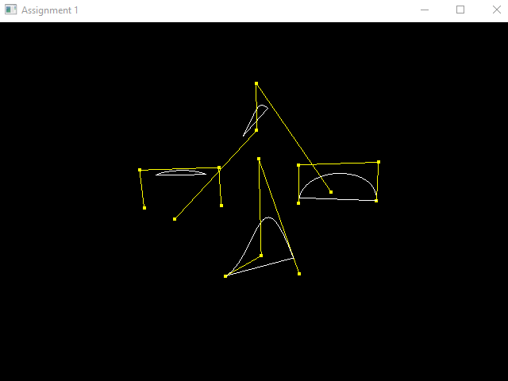
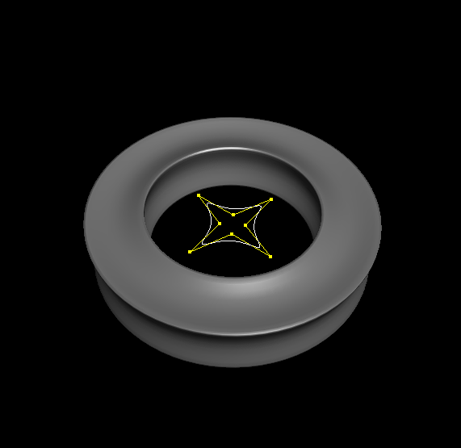

# OpenGL MIT Curves

## О программе
Программа представляет собой решение лабораторной работы по [кривым в OpenGL от MIT](https://ocw.mit.edu/courses/electrical-engineering-and-computer-science/6-837-computer-graphics-fall-2012/assignments/MIT6_837F12_assn1.pdf)

## Скриншоты

* **Кривые Безье и Б-сплайны**

* **Поверхности вращения**

")

* **Обобщенные циллиндры**

## Visual Studio Build
Build `one.sln` используя Visual Studio 2019.
